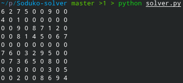
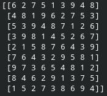

# Soduko solver 
Just a simple soduko solver , read it to learn somthing new and if u can help me where i have problem in code :> . 

### how to use 
First download it . secone run it , and get the puzzle like this :

IMPORTANT : PUT ZERO WHERE IS EMPTY . 
And you get the answer like this : 

